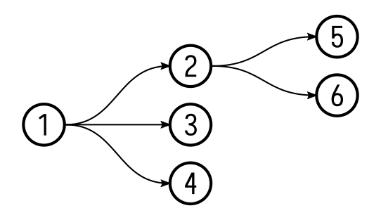

# Grit #


Grit is an experimental personal task management tool that represents tasks as nodes of a [directed acyclic graph](https://en.wikipedia.org/wiki/Directed_acyclic_graph). The graph structure enables the subdivision of tasks, and seamlessly integrates short-term and long-term goals.

## Contents

* [Build instructions](#build-instructions)
  * [Make](#make)
  * [Docker](#docker)
* [Introduction](#introduction)
* [A practical guide](#a-practical-guide)
  * [Basic usage](#basic-usage)
  * [Successors](#successors)
  * [Roots](#roots)
  * [Links](#links)
  * [Pointers](#pointers)
    * [Organizing tasks](#organizing-tasks)
    * [A reading challenge](#a-reading-challenge)
  * [More information](#more-information)
* [License](#license)


## Build instructions ##

### Make ###

Make sure `go` and `gcc` are installed on your system. Get the [latest release](https://github.com/climech/grit/releases), then run:

```
$ make && sudo make install
```

### Docker ###

(TODO)

## Introduction ##

Grit's design is based on two premises:

1. Breaking a problem up into smaller, more manageable parts is generally a good approach to problem-solving.
2. Precisely tracking your progress across time improves focus by removing the mental overhead caused by many parallel tasks spanning multiple days.

A big task can be represented as a tree, e.g.:

```
[~] Digitize family photos
 ├──[x] Scan album 1
 ├──[x] Scan album 2
 ├──[ ] Scan album 3
 └──[ ] ...
```

Here, the parent task is divided into a number of subtasks. Completing the subtasks is equivalent to completing the parent task. Trees are quite useful by themselves, but we can gain some extra powers by using the more flexible structure of a directed acyclic graph (DAG) instead:


<p align="center">
  
</p>

In a DAG, tasks are connected to one another by *directed links* (or *edges*). For our purposes, the direction flows from a task (*predecessor*) to one or more subtasks (*successors*). Unlike tree nodes, DAG nodes can have multiple predecessors, allowing us to create cross links between different task trees.

To add a time dimension to the structure, *date nodes* are introduced. A date node is a root node with a special name that conforms to the date format `YYYY-MM-DD`. Successors of a date node are supposed to be completed on the stated date. Date nodes exist so long as there are successors attached to them. They are created and destroyed automatically.

At any given time, each Grit task is said to be in one of the three states: _inactive_ `[ ]`, _in progress_ `[~]` and _completed_ `[x]`. _Inactive_ means work on the task hasn't started yet. _In progress_ indicates that some of its subtasks have been completed.

## A practical guide ##

### Basic usage ###

Let's add a few things we want to do today:

```
$ grit add "Take out the trash"
(1) -> (2)
$ grit add "Do the laundry"
(1) -> (3)
$ grit add "Call Dad"
(1) -> (4)
```

Run `grit` without arguments to display the current date node:

```
$ grit
[ ] 2020-11-10 (1)
 ├──[ ] Take out the trash (2)
 ├──[ ] Do the laundry (3)
 └──[ ] Call Dad (4)
```

So far it looks like an old-fashioned to-do list. We can mark tasks as completed using the `check` command:

```
$ grit check 2
$ grit
[~] 2020-11-10 (1)
 ├──[x] Take out the trash (2)
 ├──[ ] Do the laundry (3)
 └──[ ] Call Dad (4)
```

The change is automatically propagated through the graph. We can see that the status of the date node has changed to _in progress_.

### Successors ###

Let's add another task:

```
$ grit add "Get groceries"
(1) -> (5)
```

To divide it into subtasks, we need to specify the predecessor (when no predecessor is given, `add` defaults to the current date node):

```
$ grit add -p 5 "Bread"
(5) -> (6)
$ grit add -p 5 "Milk"
(5) -> (7)
$ grit add -p 5 "Eggs"
(5) -> (8)
```

Task 5 is now pointing to subtasks 6, 7 and 8. We can go infinitely deep if needed.

```
$ grit
[~] 2020-11-10 (1)
 ├──[x] Take out the trash (2)
 ├──[ ] Do the laundry (3)
 ├──[ ] Call Dad (4)
 └──[ ] Get groceries (5)
     ├──[ ] Bread (6)
     ├──[ ] Milk (7)
     └──[ ] Eggs (8)
```

Check the entire branch:

```
$ grit check 5
$ grit tree 5
[x] Get groceries (5)
 ├──[x] Bread (6)
 ├──[x] Milk (7)
 └──[x] Eggs (8)
```

The `tree` command prints a tree view rooted at the given node by following the links. When running `grit` without arguments, `tree` is invoked implicitly, defaulting to the current date node.

### Roots ###

Some tasks are big—they can't realistically be completed in one day, so we can't associate them with a single date node. The trick is to create a root task and break it up into smaller subtasks. Then we can associate the subtasks with specific dates.

To create a root, run `add` with the `-r` option:

```
$ grit add -r "Work through Higher Algebra - Hall, Henry S."
(9)
```

We will be referencing this node a lot—it's a good idea to give it a unique alias. We can always use aliases in place of numeric IDs.

```
$ grit alias 5 textbook
```

The book has 35 chapters—adding them each individually would be very laborious! We can use a Bash loop to make the job easier (a feature like this will probably be added in a future release):

```
$ for i in {1..35}; do grit add -p textbook "Chapter $i"; done
(9) -> (10)
(9) -> (11)
...
(9) -> (44)
```

Working through a chapter involves reading it and solving all the exercises included at the end. Chapter 1 has 28 exercises. We can go really granular here and create a node for each:

```
$ grit add -p 10 "Read the chapter"
(10) -> (45)
$ grit add -p 10 "Solve the exercises"
(10) -> (46)
$ for i in {1..28}; do grit add -p 46 "Solve ex. $i"; done
(46) -> (47)
(46) -> (48)
...
(46) -> (74)
```

Our tree so far:

```
$ grit tree textbook
[ ] Work through Higher Algebra - Hall, Henry S. (9:textbook)
 ├──[ ] Chapter 1 (10)
 │   ├──[ ] Read the chapter (45)
 │   └──[ ] Solve the exercises (46)
 │       ├──[ ] Solve ex. 1 (47)
 │       ├──[ ] Solve ex. 2 (48)
 │       ├──[ ] ...
 │       └──[ ] Solve ex. 28 (74)
 ├──[ ] Chapter 2 (11)
 ├──[ ] Chapter ...
 └──[ ] Chapter 35 (44)
```

We can do this for each chapter, or leave it for later, adding the branches as we go along. In any case, we are ready to use this tree to schedule our day!

Before we proceed, let's run `stat` to see some more information about the node:

```
$ grit stat textbook

(9) ───┬─── (10)
       ├─── (11)
       ├─── ...
       └─── (44)

ID: 9
Name: Work through Higher Algebra - Hall, Henry S.
Status: inactive (0/63)
Predecessors: 0
Successors: 35
Alias: textbook
```

We can confirm that the node is a root—it has no predecessors. There's a little map showing the node's direct predecessors and successors. Progress is also displayed, calculated by counting all the leaves reachable from the node.

### Links ###

Say we want to read the first chapter of our Algebra book and solve a few exercises today. Let's add a new task to the current date node:

```
$ grit add "Work on ch. 1 of the Algebra textbook"
(1) -> (75)
```

Create cross links to the relevant `textbook` nodes:

```
$ grit link 75 45
$ grit link 75 47
$ grit link 75 48
$ grit link 75 49
$ grit
[~] 2020-11-10 (1)
 ├──[x] ...
 └──[ ] Work on ch. 1 of the Algebra textbook (75)
     ├──[ ] Read the chapter (45)
     ├──[ ] Solve ex. 1 (47)
     ├──[ ] Solve ex. 2 (48)
     └──[ ] Solve ex. 3 (49)
```

Let's take a closer look at one them:

```
$ grit stat 45

(10) ───┐
(75) ───┴─── (45)

ID: 45
Name: Read the chapter
Status: inactive
Predecessors: 2
Successors: 0
```

Two predecessors! Now we're really taking advantage of the digraph. If you remember, the tree view can only show us the successors reachable from the given node. This gives us glimpses into the underlying graph—if we wanted to draw an accurate representation of the whole structure, it might look something like this:

<p align="center">
  
</p>

This looks *somewhat* readable. Sadly, attempts to draw an accurate representation of a structure even slightly more complex than this typically result in a tangled mess. Because of this, Grit can only show us the parts of the graph that we ask for specifically, one `tree` (or `ls`) at a time. Beyond that it relies on the user to fill in the gaps.

Any changes to the cross-linked nodes will propagate back through the entire graph:

```
$ grit check 75
$ grit
[x] 2020-11-10 (1)
 ├──[x] ...
 └──[x] Work on ch. 1 of the algebra textbook (75)
     ├──[x] Read the chapter (45)
     ├──[x] Solve ex. 1 (47)
     ├──[x] Solve ex. 2 (48)
     └──[x] Solve ex. 3 (49)
$ grit tree textbook
[~] Work through Higher Algebra - Hall, Henry S. (9:textbook)
 ├──[~] Chapter 1 (10)
 │   ├──[x] Read the chapter (45)
 │   └──[~] Solve the exercises (46)
 │       ├──[x] Solve ex. 1 (47)
 │       ├──[x] Solve ex. 2 (48)
 │       ├──[x] Solve ex. 3 (49)
 │       ├──[ ] Solve ex. 4 (50)
 │       ├──[ ] ...
 │       └──[ ] Solve ex. 28 (74)
 ├──[ ] ...
 └──[ ] Chapter 35 (44)
```

We can see we've completed all the tasks for the day, but there's still work to be done under the `textbook` node. We can schedule more work for tomorrow:

```
$ grit add -p 2020-11-11 "Work on the algebra textbook"
(149) -> (150)
$ grit add -p 150 "Solve exercises from ch. 1"
(149) -> (151)
$ grit link 151 50
$ grit link 151 51
$ grit link 151 52
$ grit link 151 53
$ grit link 151 54
$ grit add -p 150 "Work on ch. 2"
(149) -> (152)
$ grit link 152 76
$ grit link 152 78
$ grit link 152 79
$ grit link 152 80
$ grit tree 2020-11-11
[x] 2020-11-10 (149)
 └──[ ] Work on the algebra textbook (150)
     ├──[ ] Solve exercises from ch. 1 (151)
     │   ├──[ ] Solve ex. 4 (50)
     │   ├──[ ] Solve ex. 5 (51)
     │   ├──[ ] Solve ex. 6 (52)
     │   ├──[ ] Solve ex. 7 (53)
     │   └──[ ] Solve ex. 8 (54)
     └──[ ] Work on ch. 2 (152)
         ├──[ ] Read the chapter (76)
         ├──[ ] Solve ex. 1 (78)
         ├──[ ] Solve ex. 2 (79)
         └──[ ] Solve ex. 3 (80)
```

### Pointers ###

We can define a *pointer* as a node whose sole purpose is to link to other nodes. Pointers can be used to classify tasks, or as placeholders for tasks expected to be added in the future.

#### Organizing tasks ####

One aspect where Grit differs from other productivity tools is the lack of tags. This is by design—Grit is largely an experiment, and the idea is to solve problems by utilizing the graph structure to the fullest.

How do we organize our tasks without tags, then? As we add more and more nodes at the root level, things start to get messy. Running `grit ls` may result in a long list of assorted nodes. The Grit way to solve this is to make pointers.

For example, if our algebra textbook was just one of many textbooks, we could create a node named "Textbooks" and point it at them:

```
grit add -r "Textbooks"
(420)
grit alias 420 textbooks
grit link textbooks 81
grit link textbooks 184
grit link textbooks 239
grit ls textbooks
[x] Higher Algebra - Hall, Henry S. (81)
[~] Calculus - Spivak, Michael (184)
[ ] Linear Algebra - Hefferon, Jim (349)
```

This gives them a predecessor, so they no longer appear at the root level.

Note that the same node can be pointed to by an infinite number of nodes, allowing us to create overlapping categories, e.g. the same node may be reachable from "Books to read" and "Preparation for the upcoming talk", etc.

#### A reading challenge ####

A challenge can be a good motivational tool:

```
$ grit add -r "Read 24 books in 2020"
(76)
$ grit alias 76 rc2020
```

We could simply add books to it as we go, but this wouldn't give us a nice way to track our progress. Let's go a step further and create a pointer for each of the 24 books.

```
$ for i in {1..24}; do grit add -p rc2020 "Book $i"; done
(76) -> (77)
(76) -> (78)
...
(76) -> (100)
$ grit tree rc2020
[ ] Challenge: Read 24 books in 2020 (76:rc2020)
 ├──[ ] Book 1 (77)
 ├──[ ] Book 2 (78)
 ├──[ ] ...
 └──[ ] Book 24 (100)
```

Now, whenever we decide what book we want to read next, we can simply create a new task and link the pointer to it:

```
$ grit add "1984 - Orwell, George"
(1) -> (101)
$ grit link 77 101
$ grit check 101
$ grit tree rc2020
[~] Challenge: Read 24 books in 2020 (76:rc2020)
 ├──[x] Book 1 (77)
 │   └──[x] 1984 - Orwell, George (101)
 └──[ ] ...
```

The number of leaves remains the same, so `stat` will correctly display our progress:

```
$ grit stat rc2020
...
Status: in progress (1/24)
...
```

### More information ###

The guide should hopefully give you a good idea of how Grit works and how to use it. For more information refer to `grit --help`.

## License ##

This project is released under the [MIT license](https://en.wikipedia.org/wiki/MIT_License).