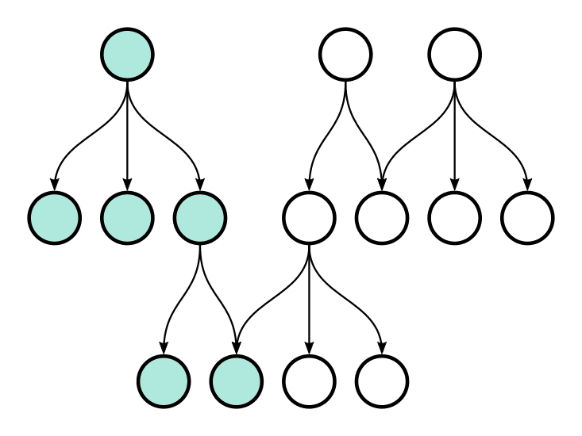
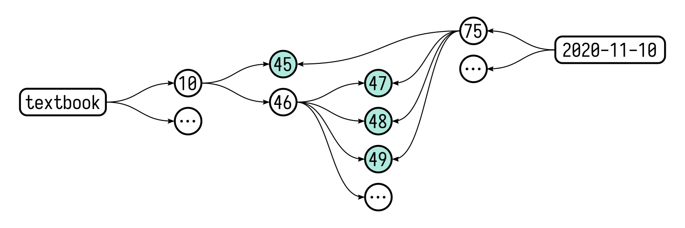

# Grit #

Grit is an experimental personal task manager that represents tasks as nodes of a [multitree](https://en.wikipedia.org/wiki/Multitree), a class of [directed acyclic graphs](https://en.wikipedia.org/wiki/Directed_acyclic_graph). The structure enables the subdivision of tasks, and supports short-term as well as long-term planning.

<p align="center">
  
</p>

## Contents

* [Build instructions](#build-instructions)
* [Introduction](#introduction)
  * [Trees](#trees)
  * [Multitrees](#multitrees)
  * [States](#states)
  * [Date nodes](#date-nodes)
* [Practical guide](#practical-guide)
  * [Basic usage](#basic-usage)
  * [Subtasks](#subtasks)
  * [Roots](#roots)
  * [Links](#links)
  * [Pointers](#pointers)
    * [Organizing tasks](#organizing-tasks)
    * [A reading challenge](#a-reading-challenge)
  * [More information](#more-information)
* [License](#license)


## Build instructions ##

Make sure `go` (>=1.14) and `gcc` are installed on your system. Get the [latest release](https://github.com/climech/grit/releases), and run:

```
$ make && sudo make install
```

## Introduction ##

*(This section is a little technical — you may want to skip over to [Practical guide](#practical-guide) first.)*

Grit's design is based on two premises:

1. Breaking a problem up into smaller, more manageable parts is generally a good approach to problem-solving.
2. Tracking progress across time improves focus by removing the mental overhead associated with many parallel tasks spanning multiple days.

Tasks may be represented as tree nodes, enabling their subdivision. By introducing *date nodes* into the structure, and viewing the trees in the context of a larger multitree, we can distribute work on root tasks across multiple days by creating cross links to their descendants.

### Trees ###

A big task may be represented as a tree, e.g.:

```
[~] Digitize family photos
 ├──[x] Scan album 1
 ├──[x] Scan album 2
 ├──[ ] Scan album 3
 └──[ ] ...
```

In the example above, the parent task is divided into a number of subtasks. Completing the subtasks is equivalent to completing the parent task.

### Multitrees ###

In [*Multitrees: Enriching and Reusing Hierarchical Structure*](http://adrenaline.ucsd.edu/kirsh/Articles/In_Process/MultiTrees.pdf), George W. Furnas and Jeff Zachs introduce the structure:

>[...] a class of directed acyclic graphs (DAGs) with the unusual property that they have large easily identifiable substructures that are trees. These subtrees have a natural semantic interpretation providing alternate hierarchical contexts for information, as well as providing a natural model for hierarchical reuse.

Unlike tree nodes, nodes of a multitree can have multiple parents, allowing us to create cross links between different task trees (see *Links* below).

Multitrees are digraphs, so the nodes are connected to one another by directed links. For our purposes, the direction flows from parent tasks to their subtasks. From any node we can induce a valid tree by following the outgoing links:

<p align="center">
  
</p>

We also get valid *inverted trees* by going in the opposite direction, from nodes to their parents! This property is used by Grit to propagate changes made at the lower levels all the way up to the roots.

### States

At any given time, a Grit task is said to be in one of the three states:

1. `[ ]` *inactive* — task is yet to be completed
2. `[~]` *in progress* — some of the subtasks have been completed
3. `[x]` *completed*

### Date nodes

To add a time dimension to the structure, the idea of a *date node* is introduced.

A date node is a root node with a special name that follows the standard date format `YYYY-MM-DD`. Descendants of date nodes are supposed to be completed on the stated date. Date nodes exist so long as they link to at least one descendant—they are created and destroyed automatically.

## Practical guide ##

### Basic usage ###

Let's add a few things we want to do today:

```
$ grit add Take out the trash
(1) -> (2)
$ grit add Do the laundry
(1) -> (3)
$ grit add Call Dad
(1) -> (4)
```

Run `grit` without arguments to display the current date tree:

```
$ grit
[ ] 2020-11-10 (1)
 ├──[ ] Call Dad (4)
 ├──[ ] Do the laundry (3)
 └──[ ] Take out the trash (2)
```

So far it looks like an old-fashioned to-do list. We can `check` a task to mark it as completed:

```
$ grit check 2
$ grit
[~] 2020-11-10 (1)
 ├──[ ] Call Dad (4)
 ├──[ ] Do the laundry (3)
 └──[x] Take out the trash (2)
```

The change is automatically propagated through the graph. We can see that the status of the parent task (the date node) has changed to _in progress_.

### Subtasks ###

Let's add another task:

```
$ grit add Get groceries
(1) -> (5)
```

To divide it into subtasks, we have to specify the parent (when no parent is given, `add` defaults to the current date node):

```
$ grit add -p 5 Bread
(5) -> (6)
$ grit add -p 5 Milk
(5) -> (7)
$ grit add -p 5 Eggs
(5) -> (8)
```

Task 5 is now pointing to subtasks 6, 7 and 8. We can create infinitely many levels, if needed.

```
$ grit
[~] 2020-11-10 (1)
 ├──[ ] Call Dad (4)
 ├──[ ] Do the laundry (3)
 ├──[ ] Get groceries (5)
 │   ├──[ ] Bread (6)
 │   ├──[ ] Eggs (8)
 │   └──[ ] Milk (7)
 └──[x] Take out the trash (2)
```

Check the entire branch:

```
$ grit check 5
$ grit tree 5
 [x] Get groceries (5)
  ├──[x] Bread (6)
  ├──[x] Eggs (8)
  └──[x] Milk (7)
```

The `tree` command prints out a tree rooted at the given node. When running `grit` without arguments, `tree` is invoked implicitly, defaulting to the current date node.

### Roots ###

Some tasks are big—they can't realistically be completed in one day, so we can't associate them with a single date node. The trick is to add it as a root task and break it up into smaller subtasks. Then we can associate the subtasks with specific dates.

To create a root, run `add` with the `-r` flag:

```
$ grit add -r Work through Higher Algebra - Henry S. Hall
(9)
```

It's useful to assign aliases to frequently used nodes. An alias is an alternative identifier that can be used in place of a numeric one.

```
$ grit alias 9 textbook
```

The book contains 35 chapters—adding each of them individually would be very laborious. We can use a Bash loop to make the job easier (a feature like this will probably be added in a future release):

```
$ for i in {1..35}; do grit add -p textbook "Chapter $i"; done
(9) -> (10)
(9) -> (11)
...
(9) -> (44)
```

Working through a chapter involves reading it and solving all the exercise problems included at the end. Chapter 1 has 28 exercises.

```
$ grit add -p 10 Read the chapter
(10) -> (45)
$ grit add -p 10 Solve the exercises
(10) -> (46)
$ for i in {1..28}; do grit add -p 46 "Solve ex. $i"; done
(46) -> (47)
(46) -> (48)
...
(46) -> (74)
```

Our tree so far:

```
$ grit tree textbook
[ ] Work through Higher Algebra - Henry S. Hall (9:textbook)
 ├──[ ] Chapter 1 (10)
 │   ├──[ ] Read the chapter (45)
 │   └──[ ] Solve the exercises (46)
 │       ├──[ ] Solve ex. 1 (47)
 │       ├──[ ] Solve ex. 2 (48)
 │       ├──[ ] ...
 │       └──[ ] Solve ex. 28 (74)
 ├──[ ] Chapter 2 (11)
 ├──[ ] Chapter ...
 └──[ ] Chapter 35 (44)
```

We can do this for each chapter, or leave it for later, building our tree as we go along. In any case, we are ready to use this tree to schedule our day.

Before we proceed, let's run `stat` to see some more information about the node:

```
$ grit stat textbook

(9) ───┬─── (10)
       ├─── (11)
       :
       └─── (44)

ID: 9
Name: Work through Higher Algebra - Henry S. Hall
Status: inactive (0/63)
Parents: 0
Children: 35
Alias: textbook
```

We can confirm that the node is a root—it has no parents. There's a little map showing the node's parents and children. Progress is also displayed, calculated by counting all the leaves reachable from the node.

### Links ###

Say we want to read the first chapter of our Algebra book, and solve a few exercises today. Let's add a new task to the current date node:

```
$ grit add Work on ch. 1 of the Algebra textbook
(1) -> (75)
```

Create cross links from this node to the relevant `textbook` nodes (the first argument to `link` is the origin, the ones following it are targets):

```
$ grit link 75 45 47 48 49
$ grit
[~] 2020-11-10 (1)
 ├──[x] ...
 └──[ ] Work on ch. 1 of the Algebra textbook (75)
     ├··[ ] Read the chapter (45)
     ├··[ ] Solve ex. 1 (47)
     ├··[ ] Solve ex. 2 (48)
     └··[ ] Solve ex. 3 (49)
```

The dotted lines indicate that the node has multiple parents. We can confirm this by taking a closer look at one of them using `stat`:

```
$ grit stat 45

(10) ───┐
(75) ───┴─── (45)

ID: 45
Name: Read the chapter
Status: inactive
Parents: 2
Children: 0
```

If we wanted to draw an accurate representation of the entire multitree at this point, it might look something like this:

<p align="center">
  
</p>

This looks somewhat readable, but attempts to draw a complete representation of a structure even slightly more complex than this typically result in a tangled mess. Because of this, Grit only gives us glimpses of the digraph, one `tree` (or `ls`) at a time. Beyond that it relies on the user to fill in the gaps.

We can check the nodes and see how the changes propagate through the graph:

```
$ grit check 75
$ grit
[x] 2020-11-10 (1)
 ├──[x] ...
 └──[x] Work on ch. 1 of the algebra textbook (75)
     ├··[x] Read the chapter (45)
     ├··[x] Solve ex. 1 (47)
     ├··[x] Solve ex. 2 (48)
     └··[x] Solve ex. 3 (49)
```

The nodes are the same, so the change is visible in the textbook tree as well as the date tree:

```
$ grit tree textbook
[~] Work through Higher Algebra - Henry S. Hall (9:textbook)
 ├──[~] Chapter 1 (10)
 │   ├··[x] Read the chapter (45)
 │   └──[~] Solve the exercises (46)
 │       ├··[x] Solve ex. 1 (47)
 │       ├··[x] Solve ex. 2 (48)
 │       ├··[x] Solve ex. 3 (49)
 │       ├──[ ] Solve ex. 4 (50)
 │       ├──[ ] ...
 │       └──[ ] Solve ex. 28 (74)
 ├──[ ] ...
 └──[ ] Chapter 35 (44)
```

We've completed all the tasks for the day, but there's still work to be done under `textbook`. We can schedule more work for tomorrow:

```
$ grit add -p 2020-11-11 Work on the algebra textbook
(149) -> (150)
$ grit add -p 150 Solve exercises from ch. 1
(149) -> (151)
$ grit link 151 50 51 52 53 54
$ grit add -p 150 Work on ch. 2
(149) -> (152)
$ grit link 152 76 78 79 80
$ grit tree 2020-11-11
[x] 2020-11-10 (149)
 └──[ ] Work on the algebra textbook (150)
     ├──[ ] Solve exercises from ch. 1 (151)
     │   ├··[ ] Solve ex. 4 (50)
     │   ├··[ ] Solve ex. 5 (51)
     │   ├··[ ] Solve ex. 6 (52)
     │   ├··[ ] Solve ex. 7 (53)
     │   └··[ ] Solve ex. 8 (54)
     └──[ ] Work on ch. 2 (152)
         ├··[ ] Read the chapter (76)
         ├··[ ] Solve ex. 1 (78)
         ├··[ ] Solve ex. 2 (79)
         └··[ ] Solve ex. 3 (80)
```

### Pointers ###

We can define a *pointer* as a non-task node whose purpose is to link to other nodes. Pointers can be used to classify tasks, or as placeholders for tasks expected to be added in the future.

#### Organizing tasks ####

One aspect where Grit differs from other productivity tools is the lack of tags. This is by choice—Grit is an experiment, and the idea is to solve problems by utilizing the multitree as much as possible.

How do we organize tasks without tags, then? As we add more and more nodes at the root level, things start to get messy. Running `grit ls` may result in a long list of assorted nodes. The Grit way to solve this is to make pointers.

For example, if our algebra textbook was just one of many textbooks, we could create a node named "Textbooks" and point it at them:

```
$ grit add -r Textbooks
(420)
$ grit alias 420 textbooks
$ grit link textbooks 81 184 349
$ grit ls textbooks
[~] Calculus - Michael Spivak (184)
[x] Higher Algebra - Henry S. Hall (81)
[ ] Linear Algebra - Jim Hefferon (349)
```

This gives them a parent, so they no longer appear at the root level.

Note that the same node can be pointed to by an infinite number of nodes, allowing us to create overlapping categories, e.g. the same node may be reachable from "Books to read" and "Preparation for the upcoming talk", etc.

#### Reading challenge ####

A challenge can be a good motivational tool:

```
$ grit add -r Read 24 books in 2020
(76)
$ grit alias 76 rc2020
```

We could simply add books to it as we go, but this wouldn't give us a nice way to track our progress. Let's go a step further and create a pointer (or "slot") for each of the 24 books.

```
$ for i in {1..24}; do grit add -p rc2020 "Book $i"; done
(76) -> (77)
(76) -> (78)
...
(76) -> (100)
$ grit tree rc2020
[ ] Challenge: Read 24 books in 2020 (76:rc2020)
 ├──[ ] Book 1 (77)
 ├──[ ] Book 2 (78)
 ├──[ ] ...
 └──[ ] Book 24 (100)
```

Now, whenever we decide what book we want to read next, we can simply create a new task and link the pointer to it:

```
$ grit add 1984 - George Orwell
(1) -> (101)
$ grit link 77 101
$ grit check 101
$ grit tree rc2020
[~] Challenge: Read 24 books in 2020 (76:rc2020)
 ├──[x] Book 1 (77)
 │   └──[x] 1984 - George Orwell (101)
 └──[ ] ...
```

The number of leaves remains the same, so `stat` will correctly display our progress:

```
$ grit stat rc2020
...
Status: in progress (1/24)
...
```

### More information ###

For more information about specific commands, refer to `grit --help`.

## License ##

This project is released under the [MIT license](https://en.wikipedia.org/wiki/MIT_License).